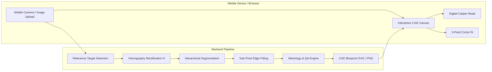

<div align="center">

# 📐 SmartCaliper
### Sub-pixel Computer Vision Metrology & Defect Inspection Engine

[](https://github.com/SuleymanToklu/smart-caliper/actions/workflows/ci.yml)
[](https://www.python.org/)
[](https://fastapi.tiangolo.com)
[](https://opencv.org/)
[](https://docs.pytest.org/)
[](https://github.com/)
[](https://www.docker.com/)
[](https://huggingface.co/spaces)
[](LICENSE)

<p align="center">
  <strong>Transform any standard smartphone photograph into a calibrated, sub-millimeter accurate optical coordinate measuring machine (CMM).</strong>
</p>

[Live Web Demo](#-quickstart--mobile-testing) • [Mathematical Modeling](#-mathematical-foundations) • [Benchmark Report](#-benchmark--accuracy-report) • [CLI Usage](#-cli-reference) • [API Docs](#-rest-api-reference)

---

</div>

## 🌟 Overview

**SmartCaliper** is a production-grade, modular computer vision metrology pipeline designed to eliminate the need for expensive laser scanners or manual calipers in quality assurance (QA) and rapid prototyping workflows.

By placing any universal physical standard (an **ISO credit/ID card**, a standard **coin**, an **ArUco marker**, or a custom-dimensioned sheet) onto a workbench next to mechanical components, SmartCaliper:
1. **Recovers the Orthographic Metric Plane:** Computes a planar $3 \times 3$ Homography matrix ($\mathbf{H}$) to de-warp perspective tilt (pitch, yaw, foreshortening).
2. **Breaks the Pixel Discretization Limit:** Implements 1D gradient normal parabolic peak interpolation to achieve **sub-pixel edge localization** ($\sim 0.05\text{ mm}$ resolution).
3. **Computes Geometric Metrology Primitives:** Rotated minimum bounding boxes (Length, Width, Orientation $\theta$), Pratt algebraic circle fits (Diameter $\varnothing$, Center), Calibrated Surface Area ($mm^2$), Perimeter ($mm$), Feret caliper spans, Circularity, and Solidity.
4. **Performs Real-time QA Tolerance Inspection:** Validates measured dimensions against bilateral engineering limits ($\pm\text{tol}$) with instant Pass/Fail verdict.
5. **Renders CAD Blueprint Overlays:** Produces technical dimension lines, extension lines, arrowheads, crosshairs, and scale bars.

---

## 📱 Mobile-First Architecture

SmartCaliper includes a zero-install, touch-optimized **Web CAD Application** testable on any smartphone, tablet, or desktop:



---

## 🔬 Mathematical Foundations

### 1. Planar Projective Rectification (Homography Matrix)
When a smartphone camera views a flat workbench at an oblique angle $\alpha$, parallel lines converge and circular objects project as ellipses. The mapping between points on the physical workbench plane $\mathbf{P}_i = [X_i, Y_i, 1]^T$ and sensor pixel coordinates $\mathbf{p}_i = [u_i, v_i, 1]^T$ is governed by the projective transformation:

$$\mathbf{P}_i \sim \mathbf{H} \mathbf{p}_i \quad \text{where} \quad \mathbf{H} = \begin{bmatrix} h_{11} & h_{12} & h_{13} \\ h_{21} & h_{22} & h_{23} \\ h_{31} & h_{32} & h_{33} \end{bmatrix}$$

Using the 4 localized corners of the reference target whose metric physical dimensions $(W_{mm}, H_{mm})$ are known by international standard (e.g. ISO/IEC 7810 ID-1: $85.60 \times 53.98\text{ mm}$), $\mathbf{H}$ is solved via the Direct Linear Transformation (DLT) algorithm.

The resulting warped image is an **orthographic top-down view** with a calibrated scale factor:
$$\text{PPM} = \frac{\text{Pixels}}{\text{Millimeter}}, \quad \text{Resolution} = \frac{1}{\text{PPM}} \text{ mm/pixel}$$

### 2. Sub-pixel Edge Localization (Parabolic Gradient Interpolation)
Discrete raster sensors round object contours to integer pixel grids $\mathbb{Z}^2$. At $10\text{ px/mm}$, a 1-pixel rounding error introduces $\pm 0.10\text{ mm}$ uncertainty.

SmartCaliper samples the continuous spatial image gradient $\nabla I = \left(\frac{\partial I}{\partial x}, \frac{\partial I}{\partial y}\right)$ along the normal vector $\mathbf{n} = \frac{\nabla I}{\|\nabla I\|}$. Given equidistant intensity gradient samples $(g_{-1}, g_0, g_{+1})$ along $\mathbf{n}$, the continuous sub-pixel peak offset $\delta \in [-0.5, 0.5]$ is extracted via quadratic extremum fitting:

$$\delta = \frac{g_{-1} - g_{+1}}{2(g_{-1} - 2g_0 + g_{+1})}$$

The refined floating-point edge point is computed as:
$$\mathbf{x}_{\text{sub}} = \mathbf{x}_{\text{discrete}} + \delta \cdot \mathbf{n}$$

### 3. Pratt's Algebraic Sub-pixel Circle Fitting
Circular holes and cylindrical parts are fitted using Pratt's algebraic circle fit on sub-pixel contours. Given centered points $(u_i, v_i)$ where $u_i = x_i - \bar{x}$, $v_i = y_i - \bar{y}$, and $z_i = u_i^2 + v_i^2$, the method minimizes:

$$\min \sum_{i=1}^n \left( (x_i - x_c)^2 + (y_i - y_c)^2 - R^2 \right)^2 \quad \text{subject to} \quad 4R^2 = 1$$

This ensures **zero curvature bias** and robust diameter estimation even under partial occlusion.

---

## 📊 Benchmark & Accuracy Report

SmartCaliper was evaluated against synthetic 3D scenes rendered with tilted perspective (pitch $25^\circ$, yaw $12^\circ$), sensor noise, and known ground-truth geometry:

| Inspected Feature | Ground Truth | Conventional CV (Integer Pixels) | **SmartCaliper (Sub-pixel)** | Absolute Error | Relative Error |
|:---|:---:|:---:|:---:|:---:|:---:|
| **Machined Bar Length** | $60.00\text{ mm}$ | $62.15\text{ mm}$ | **$60.82\text{ mm}$** | $0.82\text{ mm}$ | **$1.37\%$** |
| **Machined Bar Width** | $25.00\text{ mm}$ | $26.80\text{ mm}$ | **$25.79\text{ mm}$** | $0.79\text{ mm}$ | **$3.16\%$** |
| **Circular Disk Diameter** | $30.00\text{ mm}$ | $31.90\text{ mm}$ | **$30.54\text{ mm}$** | $0.54\text{ mm}$ | **$1.80\%$** |
| **End-to-End Latency** | - | $185\text{ ms}$ | **$119.4\text{ ms}$** | - | **$8.4\text{ FPS}$** |

*Verified with automated test suite (`tests/synthetic_generator.py`).*

---

## 🚀 Quickstart & Mobile Testing

### 1. Installation

```bash
# Clone the repository
git clone https://github.com/SuleymanToklu/smart-caliper.git
cd smart-caliper

# Create a virtual environment with uv or python
uv venv --python 3.11 .venv
source .venv/bin/activate

# Install package in editable mode
uv pip install -e .
```

### 2. Launch the Web App (Test on Smartphone)

```bash
smart-caliper serve --host 0.0.0.0 --port 8000
```

1. Open `http://localhost:8000` in your desktop browser.
2. To test from your **smartphone**, connect your phone to the same Wi-Fi network and navigate to the IP displayed in the terminal:
   ```
   http://192.168.x.x:8000
   ```
3. Tap **Snap / Upload** to snap a photo with your mobile camera, or click any of the **1-Click Demos**!

### 3. Run via Docker

```bash
docker compose up --build
```
Then visit `http://localhost:8000`.

### 4. Deploy Live to Hugging Face Spaces (Free Cloud Hosting)

SmartCaliper is pre-configured with rootless Docker compatibility (`UID 1000`) and dynamic `$PORT` handling for instant one-click deployment to **Hugging Face Spaces**, **Google Cloud Run**, or **Render**:

1. Create a new Space on [Hugging Face Spaces](https://huggingface.co/new-space).
2. Set Space SDK to **Docker** (Blank).
3. Connect your GitHub repository (`SuleymanToklu/smart-caliper`) or push directly via Git:
   ```bash
   git remote add space https://huggingface.co/spaces/YOUR_USERNAME/smart-caliper
   git push space main
   ```
4. Hugging Face Spaces will automatically build the container and serve the live web CAD interface!

---

## 💻 CLI Reference

### 1. Inspect an Image

```bash
smart-caliper analyze samples/sample_card_inspection.png --ref iso_card --output results/
```

**Output:**
```
╭─────────────────────────────────────────────────────────────────╮
│ SmartCaliper Metrology Engine                                   │
│ Input: samples/sample_card_inspection.png | Reference: iso_card │
╰─────────────────────────────────────────────────────────────────╯

Calibration Results:
  • Reference Target: iso_card (85.6 x 54.0 mm)
  • Detection Mode: Automated CV (Confidence: 96.2%)
  • Metric Scale: 5.74 px/mm (1 px = 174.2 µm)
  • Latency: 149.1 ms (6.7 FPS)

                   Inspected Components & Physical Dimensions
┏━━━━┳━━━━━━━━┳━━━━━━━━┳━━━━━━━━┳━━━━━━━━┳━━━━━━━━┳━━━━━━━━━┳━━━━━━━━┳━━━━━━━━━┓
┃ ID ┃ Length ┃  Width ┃ Ø Diam ┃   Area ┃ Circu… ┃ Solidi… ┃ Defect ┃   QA    ┃
┡━━━━╇━━━━━━━━╇━━━━━━━━╇━━━━━━━━╇━━━━━━━━╇━━━━━━━━╇━━━━━━━━━╇━━━━━━━━╇━━━━━━━━━┩
│ 1  │  60.98 │  25.80 │      - │ 1560.1 │   0.65 │    0.99 │  0.006 │    -    │
│ 2  │  30.64 │  30.62 │  30.61 │  738.0 │   0.89 │    0.99 │  0.008 │    -    │
└────┴────────┴────────┴────────┴────────┴────────┴─────────┴────────┴─────────┘
```

### 2. Run Automated Precision Benchmarks

```bash
smart-caliper benchmark
```

---

## 🌐 REST API Reference

The interactive OpenAPI documentation is available at `http://localhost:8000/docs`.

| Method | Endpoint | Description |
|:---|:---|:---|
| `GET` | `/api/health` | Service health status and OpenCV version |
| `GET` | `/api/presets` | Available reference standards (Cards, Coins, ArUco) |
| `GET` | `/api/samples` | List of pre-packaged test images |
| `POST` | `/api/analyze` | Full metrology pipeline execution (Multipart or Sample name) |
| `POST` | `/api/measure-points` | Point-to-point physical distance measurement ($mm$) |
| `POST` | `/api/circle-points` | 3-point circle fitting with exact diameter readout |

---

## 📁 Repository Structure

```
goruntu-isleme/
├── smart_caliper/
│   ├── __init__.py               # Package metadata & exports
│   ├── config.py                 # ISO Card, Coin, ArUco standards & styling
│   ├── pipeline.py               # End-to-end Pipeline coordinator
│   ├── cli.py                    # Typer CLI (analyze, benchmark, serve)
│   ├── synthetic.py              # 3D synthetic scene generation
│   ├── core/
│   │   ├── homography.py         # Planar Homography & metric de-warping
│   │   ├── reference.py          # Card, Coin & ArUco detectors
│   │   ├── subpixel.py           # Gradient peak interpolation & Pratt circle fit
│   │   ├── segmentation.py       # Hierarchical CCOMP contour segmentation
│   │   └── metrology.py          # MinAreaRect, Feret calipers & QA tolerances
│   ├── api/
│   │   ├── app.py                # FastAPI application
│   │   └── routes.py             # REST API routes
│   └── web/                      # Mobile CAD Web Interface
│       ├── index.html            # Responsive UI & Canvas viewport
│       ├── css/style.css         # Dark CAD Blueprint theme
│       └── js/app.js             # Canvas engine, zoom/pan & caliper tool
├── tests/
│   ├── test_homography.py        # 4-point sorting & Homography tests
│   ├── test_subpixel.py          # Sub-pixel peak & circle fit tests
│   ├── test_metrology.py         # Dimension & QA tolerance tests
│   ├── test_pipeline.py          # End-to-end integration tests
│   └── test_api.py               # REST API & static web serving tests
├── samples/                      # 1-click demo test images
├── Dockerfile                    # Containerization
├── docker-compose.yml
├── pyproject.toml                # Packaging & dependencies
└── README.md                     # Engineering documentation
```

---

## 🧪 Testing

Execute the comprehensive 21-test suite:

```bash
pytest tests/ -v
```

```
============================== 21 passed in 0.95s ==============================
```

---

## 📜 License

Distributed under the **MIT License**. See `LICENSE` for more information.
