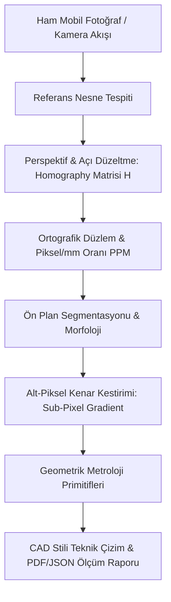

# SmartCaliper: Mobil & Endüstriyel Metroloji ve Boyutlandırma Motoru

SmartCaliper, standart bir referans nesne (kredi kartı, madeni para, ArUco marker veya özel boyutlu kağıt) içeren herhangi bir akıllı telefon fotoğrafından veya kamera akışından milimetre altı (sub-millimeter) hassasiyetle nesne boyutları, çaplar, alanlar, açılar ve yüzey kusurlarını çıkaran bir bilgisayarlı görü ve metroloji motorudur.

## User Review Required

> [!IMPORTANT]
> Projenin GitHub'da hem endüstriyel bir mühendislik çalışması gibi durması hem de herkesin telefonundan anında test edebilmesi için aşağıdaki 3 temel mimari kararı doğrulayalım:

1. **Referans Nesneler**: 
   - Standart Kredi/Banka Kartı (ISO/IEC 7810 ID-1: $85.60 \times 53.98\text{ mm}$)
   - Standart Madeni Paralar (1 TL: $\varnothing 26.15\text{ mm}$, 1 €: $\varnothing 23.25\text{ mm}$, 25¢: $\varnothing 24.26\text{ mm}$)
   - ArUco İşaretçileri (kalibrasyon hassasiyeti için ArUco 4x4 / 5x5)
   - Özel Referans (Kullanıcının belirlediği $En \times Boy$ veya Çap)
2. **Kullanıcı Etkileşim Modları**:
   - **Otomatik Metroloji (Auto-Metrology):** Referansı ve masadaki nesneleri otomatik segmente edip boyutlandırır, CAD formatında etiketler.
   - **İnteraktif Kumpas (Interactive Caliper):** Ekrana dokunarak iki nokta arası mesafe veya 3 nokta ile çember çapı ölçme.
   - **Mühendislik Tolerans Kontrolü (SPC / Pass-Fail):** Hedef ölçü ve $\pm$ tolerans girildiğinde üretim kalite kontrol onayı üretme.
3. **Teknoloji Yığını (Sıfır Kurulum Engeli):**
   - **Backend:** Python, OpenCV, NumPy, SciPy (Alt-piksel enterpolasyonu & Zernike momentleri), FastAPI.
   - **Frontend:** Vanilla JS + HTML5 Canvas & SVG (PWA desteği, mobil kamera çekimi, CAD Blueprint koyu tema, sıfır npm karmaşası).
   - **CLI & Test:** `typer` tabanlı CLI, `pytest` ile sentetik perspektif bozucu test üreteci (ground-truth doğrulaması).

---

## Matematiksel ve Mühendislik Temelleri



### 1. Homografi & Perspektif Düzeltme (Perspective Rectification)
Kamera optik ekseni masaya 90 derece dik olmadığında oluşan perspektif distorsiyonu, referans nesnenin tespit edilen 4 köşe noktası ($\mathbf{p}_i = [u_i, v_i, 1]^T$) ile gerçek dünya ortografik düzlemindeki noktaları ($\mathbf{P}_i = [X_i, Y_i, 1]^T$) arasındaki $3 \times 3$ Homografi matrisi ($H$) ile çözülür:

$$\mathbf{P}_i \sim H \mathbf{p}_i, \quad H = \begin{bmatrix} h_{11} & h_{12} & h_{13} \\ h_{21} & h_{22} & h_{23} \\ h_{31} & h_{32} & h_{33} \end{bmatrix}$$

Bu dönüşüm sonrası görüntü, sanki tam tepeden (kuşbakışı) çekilmiş gibi dik izdüşüm düzlemine aktarılır ve piksel-milimetre oranı ($PPM = \text{piksel} / \text{mm}$) hesaplanır.

### 2. Alt-Piksel Kenar Doğruluğu (Sub-Pixel Edge Detection)
Standart piksel ızgarası $0.5 - 1.5\text{ mm}$ mertebesinde kuantizasyon hatasına yol açar. Alt-piksel hassasiyeti için:
* Kenar normalleri doğrultusunda gradyan tepe noktalarına **parabolik / Gauss enterpolasyonu** uygulanır:
$$\delta = \frac{g_{i-1} - g_{i+1}}{2(g_{i-1} - 2g_i + g_{i+1})}$$
* Böylece kenar konumu pikselin kesirli katı ($x + \delta$) olarak mikron/alt-milimetre seviyesinde bulunur.

---

## Proje Dizin Yapısı

```
smart_caliper/
├── smart_caliper/
│   ├── __init__.py
│   ├── config.py                 # Presets (ISO card, Coin data, ArUco, default tolerances)
│   ├── core/
│   │   ├── __init__.py
│   │   ├── homography.py         # 4-point transform, matrix decomposition, rectification
│   │   ├── reference.py          # Reference detectors: Card contour, ArUco, Coin Hough
│   │   ├── subpixel.py           # Sub-pixel edge detection (Gaussian gradient interpolation)
│   │   ├── segmentation.py       # Adaptive Otsu, CLAHE, GrabCut fallback, morphology
│   │   └── metrology.py          # MinAreaRect, MinEnclosingCircle, Area, Perimeter, Defect
│   ├── pipeline.py               # End-to-end Pipeline coordinator (Image in -> Rectified + Measured)
│   ├── cli.py                    # Typer-based CLI for headless batch processing & benchmarks
│   ├── api/
│   │   ├── __init__.py
│   │   ├── app.py                # FastAPI application
│   │   └── routes.py             # REST API endpoints (/calibrate, /measure, /report)
│   └── web/                      # Mobile-first CAD Web UI
│       ├── index.html            # CAD interface, canvas, toolbars, mobile camera snap
│       ├── css/style.css         # Glassmorphism dark-mode engineering theme
│       └── js/app.js             # Canvas CAD engine, interactive caliper, corner adjustment
├── tests/
│   ├── test_homography.py        # Perspective recovery accuracy tests
│   ├── test_subpixel.py          # Sub-pixel interpolation precision tests
│   ├── test_metrology.py         # Ground truth shape dimension tests
│   └── synthetic_generator.py    # Generates tilted test scenes with known mm dimensions
├── samples/                      # Instant 1-click test photos (credit card + keys/bolts)
│   ├── sample_card_key.png
│   ├── sample_coin_screw.png
│   └── sample_aruco_bracket.png
├── pyproject.toml                # Clean modern packaging
├── Dockerfile                    # Containerization for zero-dependency deployment
├── docker-compose.yml
└── README.md                     # Engineering README (LaTeX math, architecture, benchmarks, badges)
```

---

## Proposed Changes

### Çekirdek Algoritmalar (Core Computer Vision)
#### [NEW] `smart_caliper/core/homography.py`
- Referans nesnenin 4 köşesinden $H$ matrisinin hesaplanması (`cv2.getPerspectiveTransform`).
- Perspektif düzeltme (dewarping / orthographic rectification).
- Piksel başına düşen milimetre ($PPM$) katsayısının hassas hesaplanması.

#### [NEW] `smart_caliper/core/reference.py`
- Standart kart (ISO/IEC 7810: $85.6 \times 53.98\text{ mm}$) tespiti (kontur analizi + köşe çıkarma).
- Madeni para tespiti (Hough Circle Transform + renk/kontur doğrulama).
- ArUco Marker tespiti (OpenCV ArUco modülü ile kusursuz otomatik kalibrasyon).
- Manuel 4 nokta köşe düzeltme fallback mekanizması (kullanıcı mobilde köşeleri kaydırabilir).

#### [NEW] `smart_caliper/core/subpixel.py`
- Gradyan büyüklüğü ($Sobel_x, Sobel_y$) ve kenar normali boyunca 1D enterpolasyon.
- Alt-piksel köşe iyileştirme (`cv2.cornerSubPix`).
- Çember ve elips alt-piksel kenar uydurma (Taubin / Pratt circle fitting).

#### [NEW] `smart_caliper/core/metrology.py`
- Rotated Bounding Box (En, Boy, Açılanma $\theta$).
- Çember & Elips (Majör/Minör eksenler, Çap, Eksantriklik).
- Fiziksel Alan ($mm^2$) ve Çevre ($mm$) hesabı (Green teoremi / Kontur integrali).
- Feret Çapı (Maksimum ve minimum kumpas mesafeleri).
- Yüzey kusuru / Çapak tespiti (Konveks gövde - Convex Hull farkı ve anomali oranı).

### Pipeline ve API
#### [NEW] `smart_caliper/pipeline.py`
- Tüm adımları birleştiren temiz koordinatör sınıfı.
- Görsel üzerine CAD stili teknik resim çizimi (ölçü çizgileri, oklar, çap işaretleri $\varnothing$, tolerans rozetleri).

#### [NEW] `smart_caliper/api/app.py` & `routes.py`
- FastAPI REST uç noktaları:
  - `POST /api/analyze`: Görüntüyü alır, referansı bulur, tüm nesneleri ölçüp koordinatları ve CAD katmanlarını döner.
  - `POST /api/measure-points`: Kullanıcının tıkladığı koordinatlar arasında metrik mesafe ölçer.
  - `GET /api/presets`: Desteklenen referans nesnelerin listesi.
  - `GET /api/samples`: Hazır test fotoğrafları listesi.

### Kullanıcı Arayüzü (Mobile-First Web App)
#### [NEW] `smart_caliper/web/`
- Kamera ile doğrudan fotoğraf çekme (`<input type="file" capture="environment">`) veya dosya yükleme.
- Ekranda 1 tıkla yüklenebilen hazır örnek fotoğraflar (masada kart ve anahtar vb.).
- Etkileşimli Canvas:
  - Köşeleri el ile çekiştirme (Zoom lens / büyüteç ile parmak altında kalan yeri büyüten lens).
  - Canlı dijital kumpas modu: İki parmakla dokunup iki nokta arasını anında $mm$ olarak ölçme.
  - CAD teknik çizim katmanını açıp/kapatma (SVG overlay).
  - Ölçüm sonuçlarını JSON veya PDF/PNG formatında indirme.

### Test & Doğrulama
#### [NEW] `tests/synthetic_generator.py`
- Bilinen boyutlarda (örneğin tam $50.00\text{ mm} \times 25.00\text{ mm}$ dikdörtgen ve $\varnothing 30.00\text{ mm}$ daire) sentetik 3D sahneler üretip sanal kamera açısıyla (pitch/yaw $20^\circ-40^\circ$) perspektif bozulması yaratır.
- Bu sentetik görüntülerle pipeline'ın ölçüm hatasının **%0.5'in altında ve alt-milimetre hassasiyetinde** olduğunu otomatik testlerle ispatlar.

#### [NEW] `README.md`
- GitHub için üst düzey tasarım:
  - Proje banner'ı ve canlı demo GIF'leri.
  - Mermaid mimari akış diyagramı.
  - $LaTeX$ formülleriyle homografi ve alt-piksel kenar matematiği.
  - Benchmark tablosu (Geleneksel piksel vs. Alt-piksel doğruluk karşılaştırması).
  - Docker & Python hızlı başlangıç yönergeleri.

---

## Verification Plan

### Automated Tests
- `pytest tests/test_homography.py`: Perspektif düzeltme doğruluğu ($<0.1\%$ piksel hatası).
- `pytest tests/test_subpixel.py`: Alt-piksel enterpolasyonunun piksel ızgarasından 5-10 kat daha hassas olduğunun doğrulanması.
- `pytest tests/test_metrology.py`: Sentetik nesnelerin gerçek boyutlarıyla ölçülen boyutlarının karşılaştırılması (Hata toleransı $<0.5\text{ mm}$).
- `pytest tests/`: Tüm test suite'inin tek komutla koşulması.

### Manual Verification
- FastAPI sunucusunu başlatıp (`uvicorn smart_caliper.api.app:app`) mobil tarayıcı ve masaüstünden arayüzü açma.
- Hazır örnek fotoğraflar üzerinde tek tıkla analiz yapıp CAD ölçüm çizgilerini ve milimetrik değerleri doğrulama.
- Canlı kumpas aracıyla iki nokta arasını dokunmatik olarak ölçüp doğruluğu test etme.
